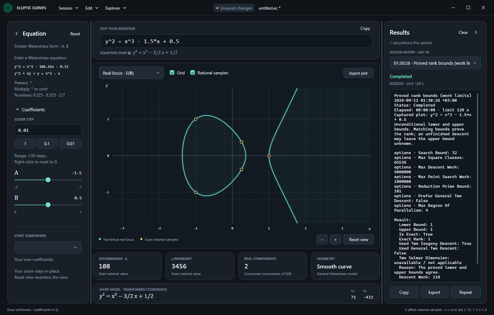

# Elliptic Curves Explorer

A WPF desktop application on .NET 8 for exploring elliptic-curve geometry and
the full computational API of the EllipticCurves library. Native calculations run
locally. The explicit LMFDB fetch commands are the only operations that use the
network; plotting and editing do not make network requests.



## Run

On Windows, install the .NET 8 SDK, then run this command from the repository root:

```powershell
dotnet run --project explorer/EllipticCurves.Explorer.csproj -c Release
```

Alternatively, open `EllipticCurves.sln` in an IDE that supports .NET 8 and choose
`EllipticCurves.Explorer` as the startup project. The application is separate from
the library's NuGet package.

To produce a folder that runs without an installed .NET runtime:

```powershell
dotnet publish explorer/EllipticCurves.Explorer.csproj -c Release -r win-x64 --self-contained true -o artifacts/explorer-win-x64
```

Run `EllipticCurves.Explorer.exe` from that folder. Distribute the entire publish
folder, including its libraries and runtime files; the executable alone is not
self-contained. For an ARM64 build, use `-r win-arm64` and a separate output
folder such as `artifacts/explorer-win-arm64`.
See [release preparation](../docs/releasing.md) for version settings, packaging
and the checks to run before publishing a release.

## Explore

- Type the entire equation in one field, for example
  `y^2 = x^3 - 106.16*x - 0.32` or `y^2 + xy + y = x^3 - x`.
  Simple and general Weierstrass forms are recognized automatically.
- Enter powers only with `^` and integer exponents from 0 to 3, such as `x^3`
  and `y^2`. Intermediate polynomials must also have degree at most 3.
  Multiplication can be explicit (`2*x*y`) or implicit (`2xy`). Parentheses, rational constant division,
  and rearranged polynomial equations are supported. The result must reduce to
  `y^2 + a1*xy + a3*y = x^3 + a2*x^2 + a4*x + a6`; variables in denominators,
  other curve families, and named functions are rejected with an explanation.
- Enter exact decimals (`8.325` or `8,325`), fractions (`-2/7`) or scientific
  notation (`1e-5`). There is no ±100 coefficient limit or one-decimal-place
  restriction. Input is parsed directly into rational numbers, without rounding.
  **EQUATION OVER ℚ** shows the applied equation with exact rational coefficients,
  for example `3/2` for an input coefficient of `1.5`.
- Open **Coefficients** for optional sliders. Each slider moves up to 50 exact
  steps on either side of its anchor. Set a positive **Slider step** there, or
  choose `1`, `0.1` or `0.01`. Changing a coefficient in the formula or changing
  the step recenters its range. Leaving the step unchanged, including an equivalent
  value such as `1/100` for `0.01`, preserves the slider positions and ranges.
  Sliders update the formula using exact arithmetic.
  **Right-click a slider to reset its coefficient to 0**, including when the
  formula field contains invalid input.
- See the discriminant, j-invariant, c₄, c₆, real component count and short model
  update after a 300 ms pause in valid input; **Enter** applies it immediately.
  The real-locus graph uses the entered coordinates; the short
  model is shown separately in transformed coordinates. Confirming unchanged input
  keeps the selected example and current samples. Equivalent equations reuse the
  samples; opening a calculation for the same curve preserves the torus selection.
- Drag the plot to pan and use the mouse wheel to zoom about the pointer. Both
  axes use the same scale. Edits preserve the viewport. **Reset view**, a double-click
  or **Ctrl+F** recenters the view around the real branch points and part of the
  unbounded branch. With the plot focused, **Home** fits and **+ / −** zoom.
  Slider arrow keys move by the chosen exact step.
- Hover near a branch to inspect approximate coordinates, or near a gold marker
  to see an exact rational point.
- Choose one of four built-in examples, including a singular cubic. Preset names
  such as `37.a1` are static labels and do not trigger database lookups.
  Choosing an example fits the real plot and resets the torus camera. If the real
  plot is hidden, it is fitted when you next switch to **Real locus**.
- **Reset** in the Equation header asks for confirmation before restoring
  `y^2 = x^3 - x` and recentering the plot. The custom dark dialog opens centered
  on the main window without highlighting either button. Enter or Escape cancels
  from the initial state; the close button also cancels.
- Copy the equation and exact invariants, or export the current plot to PNG.

## Complex torus

The plot's mode selector switches between **Real locus · E(ℝ)** and
**Complex torus · E(ℂ)**. The complex view has two linked panels:

- **Period lattice** shows a fundamental parallelogram with its opposite edges
  identified. The drawing is scaled by ω₁, so its two basis vectors are 1 and
  τ = ω₂/ω₁. This basis is adapted to the real points; τ is not reduced to the
  modular fundamental domain. The numerical periods above it refer to the global minimal model;
  their tooltip gives that model's equation.
- **Complex torus** shows a fixed topological embedding of ℂ/Λ. The ring's
  radii do not represent the curve's complex structure; that information is in
  the lattice and τ. The turquoise and blue cycles correspond to ω₁ and ω₂.

The legend shows **Selected point** with a white dot, followed by
**Exact rational samples** with a gold dot, using the same styling as the real plot.
Gold markers represent the same bounded rational samples as the real plot;
the selected point is white in both panels. The point at infinity **O** is included
at the lattice origin. Select a point from the dropdown or click a marker in
either panel to highlight it in both.
Repeated boundary markers in the parallelogram represent the same point after
edge identification. Exact x/y coordinates remain in the entered curve's model;
their period coordinates u and v are numerical elliptic logarithms, with
z ≡ uω₁ + vω₂. Up to 32 distinct affine samples are mapped, with the mapped count
and any numerical failures shown below the view. This is not a complete point list.

Drag the torus to rotate it and scroll to zoom. With it focused, arrow keys rotate,
**Home** resets the camera and **+ / −** zoom. **Reset view**, a double-click on
the torus, or **Ctrl+F** restores the camera. Arrow keys in the lattice cycle
through the markers. **Grid** toggles the subdivisions in both panels;
**Rational samples** hides affine markers while retaining O. The real plot keeps
its viewport when switching modes unless an example or **Reset** was selected
while it was hidden. Editing coefficients preserves that viewport in either mode;
**Reset view** and **Ctrl+F** affect only the active mode. The **−**, **+** and **Reset view** buttons
remain in the same position in both modes. In a small window the complex view
scrolls vertically to keep its diagrams readable.

Period and point mapping calculations run locally in the background only while
the complex mode is open. They use a 180 ms debounce, a 15-second cancellation
deadline and bounded root-isolation/iteration work. Changing the curve or leaving
the mode cancels outstanding work; late results cannot replace the current curve.
The period lattice remains usable if subsequent point mapping reaches its limit.
Singular cubics (Δ = 0) show an explanation
instead of a smooth torus. No internet connection or extra graphics package is needed.

## PNG export

**Export plot** saves the active visualization with a dark background at twice
its WPF layout dimensions (192 DPI). In real-locus mode, the image contains the
graph, axes and visible rational markers. In complex mode, it contains the visible
period-lattice and torus panels, point selector and notes, preserving the current
camera and selection. Complex export becomes available once the period lattice
is ready, even if point mapping is still running.

The image excludes the surrounding equation, results and invariant panels, as
well as the shared plot toolbar, legend and navigation buttons. For a compact
complex view, the current scroll position determines what is captured; content
outside the scroll viewport is not included. Enlarge the plot area to fit more
content before exporting. Export does not reset the camera or change the live layout.

## Calculation scope

The real locus uses double-precision drawing coordinates and is a numerical
visualization. Completing the square handles both branches and the linear y
terms; sampling is split at real roots to preserve disconnected components.
The point at infinity is not drawn in the affine plot.
Inputs outside the numerical plot's representable range retain exact invariants
and show a plot precision message. To bound input processing, text is limited to
4096 characters and scientific exponents to ±4096. Numerators and denominators
of intermediate expressions and normalized coefficients are limited to 32768 bits
(roughly 9800 decimal digits); parser nesting is also limited to 64 levels.
These checks bound expression growth during input processing.

Gold markers are exact affine rational points found with `RationalPoints(12, 4)`:
their x-coordinates are `m/n`, with `|m| ≤ 12` and `1 ≤ n ≤ 4`. This is a bounded
sample, not a complete list of rational points or a Mordell–Weil basis. The search
runs in the background after a 120 ms debounce. Superseded searches are cancelled,
and markers are cleared when a new curve is applied. While editing, existing
markers continue to belong to the displayed curve.

For Δ = 0 the cubic is still drawn, but j and the elliptic real-component count
are marked undefined, and rational sampling is disabled. Invalid or incomplete
text input retains the last valid curve with a neutral editing status. Validation
is shown after leaving the field or pressing **Enter**, so partial input such as
`-` or `1/` is not highlighted while typing.

In **Real locus** mode, coefficient updates invoke only the inexpensive native
invariants and the bounded sample search described above. The optional complex
view additionally computes periods and numerical point mappings. Rank, conductor,
torsion enumeration and heights require an explicit Explorer calculation.

## Explorer calculations

Open **Explorer** in the title bar, choose a category or search for an operation.
Each operation opens a movable, modeless parameter window. The curve is captured
when the window opens, so editing the plot later does not silently change a pending
calculation. Finite-extension curves and rational-number tools have independent
inputs. **Run calculation** opens the results panel on the right.

The title bar contains **Explorer**. Clicking the logo or **ELLIPTIC CURVES** opens
the project's GitHub repository in the default browser. **Export plot** is in the
plot panel's own toolbar.

| Category | Available calculations |
| --- | --- |
| Curve and models | Exact coefficients and invariants, real components, CM discriminant, short and global minimal models, twists, construction from j |
| Rational points and torsion | Membership, addition, subtraction, negation, doubling, scalar multiplication, bounded rational/integral searches, all torsion points, torsion order and group structure |
| Ranks and arithmetic | Both rank-bound interfaces, analytic rank and certification, conductor, root number, local reduction data, Tamagawa product |
| Heights and periods | Naive, canonical, local and archimedean heights, height pairing and matrix, regulator, Faltings and stable Faltings heights, certified periods and numerical elliptic logarithms |
| Isomorphisms and isogenies | Isomorphism tests and maps, coordinate changes and inverse maps, minimal-model maps, Vélu and 2-isogenies with duals, point mapping, division and prime-by-prime saturation |
| Fourier coefficients and reduction | Individual or ranged Fourier coefficients, Frobenius traces, minimal-model point counts, reduction of curves and points |
| Prime and extension fields | Curve construction and invariants, points, group operations, enumeration and counting; point order over Fp |
| Finite-field arithmetic | Field construction, elements, addition, subtraction, negation, multiplication, division, inverses and powers |
| Rational arithmetic | Exact rational representation, arithmetic, comparison, powers, square testing and exact square roots |
| LMFDB | Fetch all supported database metadata, map database generators onto the captured model, import stored JSON without internet |

Point inputs have separate x/y fields and an infinity checkbox. Point lists use
one `x; y` pair per line (`O` for infinity). Field elements and defining
polynomials use coefficients in ascending powers of t separated by semicolons:
`0; 1` is t and `2; 0; 1` is t^2 + 2. Over Fp, curve tools reduce the **entered**
coefficients; the separate reduction operations use a **global minimal model**.

Both rank-bound actions enable parallel general descent by default, using up to
four workers (fewer when fewer processors are available). In **Precision and work
limits**, set **Max Degree Of Parallelism** to `1` for sequential execution or to
another positive worker limit. All workers share the same work allowances;
increasing the worker count does not increase **Max Descent Work**. The 2-isogeny
method remains sequential, and incomplete descent still returns an unknown upper
bound. The library itself defaults to sequential execution.

Open **Precision and work limits** for each algorithm's options. Every run also has
a wall-clock time limit (120 seconds by default; 0 means unlimited, with a maximum
nonzero setting of 86,400 seconds) and an output item limit (1,000 by default,
configurable from 1 to 100,000). The item limit applies separately to each list
or matrix in the result. Lists exceeding it are explicitly marked as truncated.
The formatted result has an additional fixed budget of approximately 2 million
characters; the report header, input parameters and truncation notice are extra.
Increasing the item limit does not raise that text budget. These limits do not
convert partial searches into completeness claims.

The progress bar shows the current stage and elapsed time. Where the library
does not report completed work, the bar remains indeterminate; item formatting
can show measured progress when the collection size is known. **Stop** and the
time limit terminate the calculation process, including methods without cooperative
cancellation. Only one calculation runs at a time; plotting remains interactive.

Results retain their input curve, parameters and proof/certification status.
Height results include exact enclosure bounds; database decimals are labelled
as approximations. A completed calculation does not imply a proved rank or a
complete Mordell–Weil basis: the library's status and reason are preserved.
Use **Copy** or **Save** to export the displayed text report. **Repeat** reopens
the parameter window with that result's original curve, inputs and limits; it
does not start another calculation until you choose **Run calculation**.
To remove a result, right-click its entry in the history dropdown and choose
**Delete**. This deletes that entry,
even when another result is displayed; stop an active calculation before deleting it. History keeps the last
50 calculations for the current session; save reports before closing the app.
**Clear** in the Results header removes the entire session history after
confirmation in the same dark dialog. **Clear** is disabled while a calculation
is running or the history is empty. Saved report files are unaffected.
Both side panels start at their minimum widths. Drag either divider to resize its
panel; matching gaps and dividers keep the two sides aligned.
The **Equation** and **Results** panels each have a header chevron that folds the
panel into a narrow, full-height tab on its own side, freeing space for the plot.
The folded and expanded versions share the same top, bottom and outer edge,
including the window margin. Either panel can be folded independently; click its
tab to restore it. Both panels retain their resized width, and Equation keeps its
settings and Coefficients state. Folding uses a short animation when Windows allows
interface animations. A dot on the folded Results tab indicates a running
calculation; the result selection and history remain intact.

## Development

The XAML theme, plot control, immutable calculation snapshots and view models are
separate files. No external charting or UI package is required. The portable model
and view-model sources are linked into the existing test project, so their tests
also run without WPF on non-Windows systems. To run only the Explorer-related tests:

```powershell
dotnet test tests/EllipticCurves.Tests.csproj -c Release --filter "FullyQualifiedName~Explorer"
```

Omit the filter to run all arithmetic and portable Explorer tests. After the
initial dependency restore, these tests use local fixtures and simulated HTTP
responses rather than live LMFDB requests.

The calculation catalog covers public mathematical methods on rational curves,
Fp/Fq curves, finite fields and rational numbers; explicit entries cover computed
properties, returned isomorphism/isogeny maps and LMFDB. Object identity methods,
formatting and duplicate aliases are not separate actions. Coverage tests check
every public method, parameter conversion and representative offline invocation.

The executable's private `--compute-worker` entry point uses redirected UTF-8
streams before creating WPF. `CalculationRunner` owns its child process and
terminates it on cancellation, timeout or app shutdown. The worker also exits if
the host disconnects. A portable test host exercises this protocol, errors,
non-cooperative cancellation and disconnect behavior without opening any UI.

On Windows, also run the compiled-XAML regression check. This standalone host is
not included in `dotnet test EllipticCurves.sln`. It loads the real theme and main
workspace and verifies Explorer click/focus scrolling, history-menu deletion,
acceptance/rejection of Clear and Reset, the presence of Repeat, both sidebars'
folding, aligned bounds at different window sizes, animation and PNG rendering.
PNG checks cover both embedded views, offsets within the window, fractional layout
sizes, dark backgrounds and preservation of content at the image edges. It also
checks the complex view's shared point selection and compact layout, fitting
presets selected while the real plot is hidden, and viewport preservation across
mode changes and coefficient edits.
It uses an invisible native layout host and shows no application windows:

```powershell
dotnet run --project tests/PresentationHost/PresentationHost.csproj -c Release
```

The desktop project uses the [Microsoft .NET Desktop SDK settings](https://learn.microsoft.com/en-us/dotnet/core/project-sdk/msbuild-props-desktop).

The application logo is `ec_logo.png`; it is embedded as a WPF resource for the
header and window icon. After replacing the PNG, run `./explorer/tools/Update-Icon.ps1`
from the repository root to regenerate the executable's multi-size `ec_logo.ico`,
then rebuild the application.
