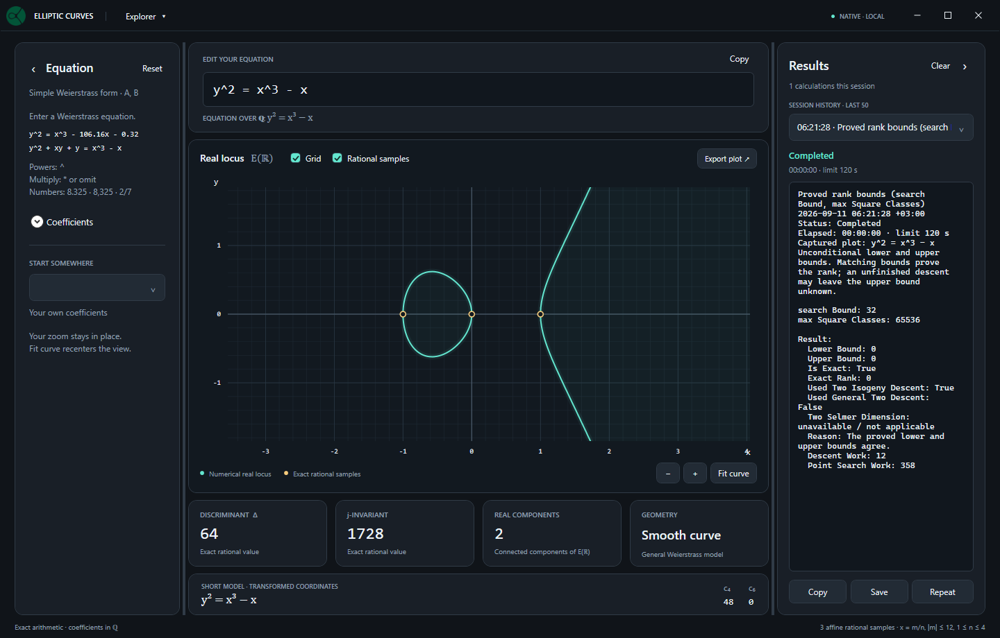

# Elliptic Curves Explorer

A WPF desktop application on .NET 8 for exploring elliptic-curve geometry and
the full computational API of the EllipticCurves library. Native calculations run
locally. The explicit LMFDB fetch commands are the only operations that use the
network; plotting and editing do not make network requests.



## Run

On Windows, install the .NET 8 SDK, then run this command from the repository root:

```powershell
dotnet run --project explorer/EllipticCurves.Explorer.csproj -c Release
```

Alternatively, open `EllipticCurves.sln` in an IDE that supports .NET 8 and choose
`EllipticCurves.Explorer` as the startup project. The application is separate from
the library's NuGet package.

To produce a folder that runs without an installed .NET runtime:

```powershell
dotnet publish explorer/EllipticCurves.Explorer.csproj -c Release -r win-x64 --self-contained true -o artifacts/explorer-win-x64
```

Run `EllipticCurves.Explorer.exe` from that folder. Use `win-arm64` instead of
`win-x64` for an ARM64 build.

## Explore

- Type the entire equation in one field, for example
  `y^2 = x^3 - 106.16*x - 0.32` or `y^2 + xy + y = x^3 - x`.
  Simple and general Weierstrass forms are recognized automatically.
- Enter powers only with `^`, such as `x^3` and `y^2`. Multiplication can be
  explicit (`2*x*y`) or implicit (`2xy`). Parentheses, rational constant division,
  and rearranged polynomial equations are supported. The result must reduce to
  `y^2 + a1*xy + a3*y = x^3 + a2*x^2 + a4*x + a6`; variables in denominators,
  other curve families, and named functions are rejected with an explanation.
- Enter exact decimals (`8.325` or `8,325`), fractions (`-2/7`) or scientific
  notation (`1e-5`). There is no ±100 coefficient limit or one-decimal-place
  restriction. Input is parsed directly into rational numbers, without rounding.
- Open **Coefficients** for optional sliders. Each slider moves up to 50 exact
  steps on either side of its anchor. Set a positive **Slider step** there, or
  choose `1`, `0.1` or `0.01`. Changing a coefficient in the formula or changing
  the step recenters its range. Sliders update the formula using exact arithmetic.
  **Right-click a slider to reset its coefficient to 0**, including when the
  formula field contains invalid input.
- See the discriminant, j-invariant, c₄, c₆, real component count and short model
  update after a 300 ms pause in valid input; **Enter** applies it immediately.
  The graph always uses the entered coordinates; the short
  model is shown separately in transformed coordinates.
- Drag the plot to pan and use the mouse wheel to zoom about the pointer. Both
  axes use the same scale. Edits preserve the viewport. **Fit curve**, a double-click
  or **Ctrl+F** recenters the view around the real branch points and part of the
  unbounded branch. With the plot focused, **Home** fits and **+ / −** zoom.
  Slider arrow keys move by the chosen exact step.
- Hover near a branch to inspect approximate coordinates, or near a gold marker
  to see an exact rational point.
- Choose one of four built-in examples, including a singular cubic. Preset names
  such as `37.a1` are static labels and do not trigger database lookups.
- **Reset** in the Equation header asks for confirmation before restoring
  `y^2 = x^3 - x` and recentering the plot. The custom dark dialog opens centered
  on the main window with **Cancel** focused; Escape or the close button cancels.
- Copy the equation and exact invariants, or export the current plot to PNG.

## Calculation scope

The real locus uses double-precision drawing coordinates and is a numerical
visualization. Completing the square handles both branches and the linear y
terms; sampling is split at real roots to preserve disconnected components.
The point at infinity is not drawn in the affine plot.
Inputs outside the numerical plot's representable range retain exact invariants
and show a plot precision message. To bound input processing, text is limited to
4096 characters and scientific exponents to ±4096. Numerators and denominators
of intermediate expressions and normalized coefficients are limited to 32768 bits
(roughly 9800 decimal digits), so nested numeric powers cannot freeze the editor.

Gold markers are exact affine rational points found with `RationalPoints(12, 4)`:
their x-coordinates are `m/n`, with `|m| ≤ 12` and `1 ≤ n ≤ 4`. This is a bounded
sample, not a complete list of rational points or a Mordell–Weil basis. The search
runs in the background after a 120 ms debounce. Superseded searches are cancelled,
and markers are cleared when a new curve is applied. While editing, existing
markers continue to belong to the displayed curve.

For Δ = 0 the cubic is still drawn, but j and the elliptic real-component count
are marked undefined, and rational sampling is disabled. Invalid or incomplete
text input retains the last valid curve with a neutral editing status. Validation
is shown after leaving the field or pressing **Enter**, so partial input such as
`-` or `1/` is not highlighted while typing.

Rank, conductor, torsion enumeration, heights and periods are not automatically
computed by this application. Coefficient updates invoke only the inexpensive native
invariants and the bounded sample search described above.

## Explorer calculations

Open **Explorer** in the title bar, choose a category or search for an operation.
Each operation opens a movable, modeless parameter window. The curve is captured
when the window opens, so editing the plot later does not silently change a pending
calculation. Finite-extension curves and rational-number tools have independent
inputs. **Run calculation** opens the results panel on the right.

The title bar contains Explorer and the native/local status indicator. **Export
plot** is in the plot panel's own toolbar.

| Category | Available calculations |
| --- | --- |
| Curve and models | Exact coefficients and invariants, real components, CM discriminant, short and global minimal models, twists, construction from j |
| Rational points and torsion | Membership, addition, subtraction, negation, doubling, scalar multiplication, bounded rational/integral searches, all torsion points, torsion order and group structure |
| Ranks and arithmetic | Both rank-bound interfaces, analytic rank and certification, conductor, root number, local reduction data, Tamagawa product |
| Heights and periods | Naive, canonical, local and archimedean heights, height pairing and matrix, regulator, Faltings and stable Faltings heights, certified periods and numerical elliptic logarithms |
| Isomorphisms and isogenies | Isomorphism tests and maps, coordinate changes and inverse maps, minimal-model maps, Vélu and 2-isogenies with duals, point mapping, division and prime-by-prime saturation |
| Fourier coefficients and reduction | Individual or ranged Fourier coefficients, Frobenius traces, minimal-model point counts, reduction of curves and points |
| Prime and extension fields | Curve construction and invariants, points, group operations, enumeration and counting; point order over Fp |
| Finite-field arithmetic | Field construction, elements, addition, subtraction, negation, multiplication, division, inverses and powers |
| Rational arithmetic | Exact rational representation, arithmetic, comparison, powers, square testing and exact square roots |
| LMFDB | Fetch all supported database metadata, map database generators onto the captured model, import stored JSON without internet |

Point inputs have separate x/y fields and an infinity checkbox. Point lists use
one `x; y` pair per line (`O` for infinity). Field elements and defining
polynomials use coefficients in ascending powers of t separated by semicolons:
`0; 1` is t and `2; 0; 1` is t^2 + 2. Over Fp, curve tools reduce the **entered**
coefficients; the separate reduction operations use a **global minimal model**.

Open **Precision and work limits** for each algorithm's options. Every run also has
a wall-clock time limit (120 seconds by default; 0 means unlimited) and an output
item limit. Lists exceeding the output limit are explicitly marked as truncated.
The text report is capped at 2 million characters. These limits do not convert
partial searches into completeness claims.

The progress bar shows the current stage and elapsed time. Where the library
does not report completed work, the bar remains indeterminate; item formatting
can show measured progress when the collection size is known. **Stop** and the
time limit terminate the calculation process, including methods without cooperative
cancellation. Only one calculation runs at a time; plotting remains interactive.

Results retain their input curve, parameters and proof/certification status.
Height results include exact enclosure bounds; database decimals are labelled
as approximations. A completed calculation does not imply a proved rank or a
complete Mordell–Weil basis: the library's status and reason are preserved.
Use **Copy**, **Save** or **Repeat** on the displayed result. To remove a result, right-click
its entry in the history dropdown and choose **Delete**. This deletes that entry,
even when another result is displayed; stop an active calculation before deleting it. History keeps the last
50 calculations for the current session; save reports before closing the app.
**Clear** in the Results header removes the entire session history after
confirmation in the same dark dialog, with **Cancel** focused by default. It is disabled while a calculation
is running or the history is empty. Saved report files are unaffected.
Both side panels start at their minimum widths. Drag either divider to resize its
panel; matching gaps and dividers keep the two sides aligned.
The **Equation** and **Results** panels each have a header chevron that folds the
panel into a narrow, full-height tab on its own side, freeing space for the plot.
The folded and expanded versions share the same top, bottom and outer edge,
including the window margin. Either panel can be folded independently; click its
tab to restore it. Both panels retain their resized width, and Equation keeps its
settings and Coefficients state. Folding uses a short animation when Windows allows
interface animations. A dot on the folded Results tab indicates a running
calculation; the result selection and history remain intact.

## Development

The XAML theme, plot control, immutable calculation snapshots and view models are
separate files. No external charting or UI package is required. The portable model
and view-model sources are linked into the existing test project, so their tests
also run without WPF on non-Windows systems:

```powershell
dotnet test tests/EllipticCurves.Tests.csproj -c Release --filter "FullyQualifiedName~Explorer"
```

The calculation catalog covers public mathematical methods on rational curves,
Fp/Fq curves, finite fields and rational numbers; explicit entries cover computed
properties, returned isomorphism/isogeny maps and LMFDB. Object identity methods,
formatting and duplicate aliases are not separate actions. Coverage tests check
every public method, parameter conversion and representative offline invocation.

The executable's private `--compute-worker` entry point uses redirected UTF-8
streams before creating WPF. `CalculationRunner` owns its child process and
terminates it on cancellation, timeout or app shutdown. The worker also exits if
the host disconnects. A portable test host exercises this protocol, errors,
non-cooperative cancellation and disconnect behavior without opening any UI.

On Windows, also run the compiled-XAML regression check. It loads the real theme
and main workspace, verifies history-menu deletion, acceptance/rejection of Clear
and Reset, Repeat, both sidebars' folding,
aligned bounds at different window sizes, the animation and PNG rendering, and never opens a window:

```powershell
dotnet run --project tests/PresentationHost/PresentationHost.csproj -c Release
```

The desktop project uses the [Microsoft .NET Desktop SDK settings](https://learn.microsoft.com/en-us/dotnet/core/project-sdk/msbuild-props-desktop).

The application logo is `ec_logo.png`; it is embedded as a WPF resource for the
header and window icon. After replacing the PNG, run `./explorer/tools/Update-Icon.ps1`
from the repository root to regenerate the executable's multi-size `ec_logo.ico`,
then rebuild the application.
